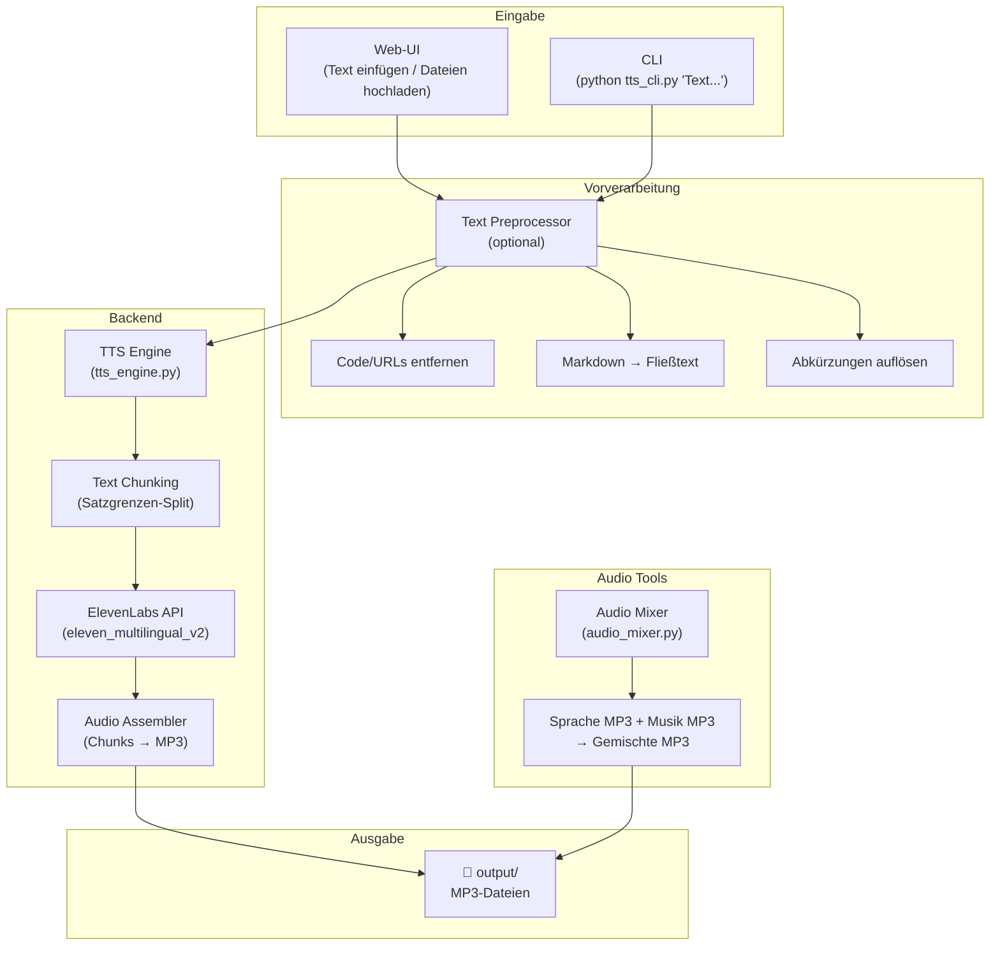

# Text-to-Speech Toolkit mit ElevenLabs API

Aufbau eines vollständigen TTS-Toolkits im Ordner `learning/text-to-speech/`, das Text in natürlich klingende MP3-Dateien umwandelt – ideal zum Anhören beim Spazierengehen.

## Status: In Planung

- **Erstellt**: 2026-06-20
- **Zuletzt aktualisiert**: 2026-06-20

## User Review Required

> [!IMPORTANT]
> **ElevenLabs API-Key erforderlich**: Du benötigst einen gültigen API-Key von [ElevenLabs](https://elevenlabs.io/). Der Key wird in einer `.env`-Datei hinterlegt.

> [!NOTE]
> **Voice**: `NBqeXKdZHweef6y0B67V` (Christian) wird als Standard-Stimme verwendet. Über die Web-UI können weitere Stimmen aus dem Account ausgewählt werden.

> [!NOTE]
> **Dateiformate**: `.txt`, `.md`, `.pdf` – bestätigt.

> [!WARNING]
> **Zeichenlimits**: Das Modell `eleven_multilingual_v2` erlaubt max. 10.000 Zeichen pro API-Aufruf. Längere Texte werden automatisch an Satzgrenzen in Chunks aufgeteilt und die Audio-Teile nahtlos zusammengefügt.

## Architektur-Übersicht



## Proposed Changes

### Projektstruktur

```
text-to-speech/
├── .env                    # API-Key (wird nicht committed)
├── .env.example            # Vorlage für .env
├── .gitignore              # Schließt .env, output/, venv/ aus
├── requirements.txt        # Python-Dependencies
├── config.py               # Zentrale Konfiguration
├── text_preprocessor.py    # Optionaler Text-Präprozessor
├── tts_engine.py           # Kern-Modul: Text → MP3 via ElevenLabs
├── tts_cli.py              # CLI-Tool für externen Aufruf
├── audio_mixer.py          # Sprache + Musik überlagern
├── app.py                  # Flask Web-Server
├── templates/
│   └── index.html          # Web-UI (Single Page)
├── static/
│   ├── css/
│   │   └── style.css       # Premium-Design
│   └── js/
│       └── app.js          # Frontend-Logik
├── output/                 # Generierte MP3s (gitignored)
└── README.md               # Dokumentation
```

---

### Text-Präprozessor (optional)

#### [NEW] text_preprocessor.py

Optionales Modul, das Text vor dem Vorlesen aufbereitet. Wird über `--preprocess` (CLI) oder einen Toggle (Web-UI) aktiviert.

**`preprocess(text, source_format="auto")`** – Hauptfunktion, ruft nacheinander alle Bereinigungsschritte auf:

| Schritt | Was passiert | Beispiel |
|---|---|---|
| **Code entfernen** | Fenced Code Blocks (` ``` `) und Inline-Code (`` ` ``) entfernen | `` `print("hi")` `` → *(entfernt)* |
| **Markdown-Syntax entfernen** | `#`, `**`, `*`, `>`, `---`, Bild-/Link-Syntax bereinigen | `## Kapitel` → `Kapitel` |
| **Links auflösen** | `[Text](url)` → nur den Text behalten, nackte URLs entfernen | `[Docs](https://...)` → `Docs` |
| **Tabellen → Fließtext** | Markdown-Tabellen in lesbare Aufzählungen umwandeln | Tabelle → "Spalte A ist Wert B. ..." |
| **Aufzählungen glätten** | `- Item` / `1. Item` → kommaseparierte Aufzählung oder Fließsätze | `- Eins\n- Zwei` → `Eins, Zwei.` |
| **Steuerzeichen entfernen** | `\t`, `\r`, überschüssige Leerzeilen, Unicode-Steuerzeichen | `\t\t  text` → `text` |
| **Sonderzeichen auflösen** | `&`, `→`, `>=`, `!=` etc. in gesprochene Form umwandeln | `>=` → `größer oder gleich` |
| **Abkürzungen auflösen** | Gängige Abkürzungen zu gesprochener Form expandieren | `z.B.` → `zum Beispiel`, `d.h.` → `das heißt` |
| **HTML-Tags entfernen** | `<br>`, `<div>` etc. aus eingebettetem HTML entfernen | `<b>fett</b>` → `fett` |
| **Normalisierung** | Mehrfache Leerzeichen/Zeilenumbrüche auf ein Minimum reduzieren | — |

**Design-Prinzip**: Jeder Schritt ist eine eigene private Methode, sodass einzelne Schritte leicht aktiviert/deaktiviert oder erweitert werden können.

**Quellformat-Erkennung**: Der Parameter `source_format` kann `"txt"`, `"md"` oder `"pdf"` sein. Bei `"auto"` wird das Format anhand des Inhalts erkannt (z.B. ob Markdown-Syntax vorkommt). Bei reinen `.txt`-Dateien werden Markdown-spezifische Schritte übersprungen.

---

### Kern-Modul: TTS Engine

#### [NEW] tts_engine.py

Das zentrale Modul, das von CLI und Web-UI gleichermaßen genutzt wird:

- **`TextToSpeech`-Klasse** mit konfigurierbarer Voice-ID, Modell und Output-Format
- **`convert_text(text, output_path, preprocess=False)`** – Hauptmethode: Text → MP3. Bei `preprocess=True` wird der Text zuerst durch `text_preprocessor.preprocess()` geschickt.
- **`_chunk_text(text, max_chars=9500)`** – Splittet lange Texte an Satzgrenzen (`.`, `!`, `?`), um das 10.000-Zeichen-Limit einzuhalten
- **`_generate_chunk(chunk)`** – Einzelnen Chunk via `client.text_to_speech.convert()` an ElevenLabs senden
- **`_assemble_chunks(chunks, output_path)`** – Mehrere Audio-Chunks via `pydub` zu einer MP3 zusammenfügen
- **`list_voices()`** – Verfügbare Stimmen aus dem ElevenLabs-Account abrufen
- Standard-Voice: `NBqeXKdZHweef6y0B67V` (Christian)
- Output-Format: `mp3_44100_128` (CD-Qualität, 128kbps)

---

### CLI-Tool

#### [NEW] tts_cli.py

Kommandozeilen-Tool für externe Aufrufe mit `argparse`:

```bash
# Text direkt übergeben
python tts_cli.py "Dies ist ein Beispieltext zum Vorlesen."

# Text aus Datei lesen
python tts_cli.py --file artikel.txt

# Mehrere Dateien
python tts_cli.py --file kapitel1.txt kapitel2.txt

# Mit Präprozessor (entfernt Code, Markdown-Syntax etc.)
python tts_cli.py --file README.md --preprocess

# Mit Custom Voice
python tts_cli.py "Text..." --voice-id NBqeXKdZHweef6y0B67V

# Ausgabedatei benennen
python tts_cli.py "Text..." --output mein_audio.mp3

# Verfügbare Stimmen auflisten
python tts_cli.py --list-voices
```

---

### Audio Mixer

#### [NEW] audio_mixer.py

Tool zum Überlagern von Sprache und Hintergrundmusik:

- **`mix_audio(speech_path, music_path, output_path, music_volume_db=-15)`**
  - Lädt beide MP3-Dateien via `pydub`
  - Reduziert Musik-Lautstärke (Standard: -15 dB unter Sprache)
  - Loopt Musik automatisch, falls kürzer als die Sprache
  - Überlagert Musik unter die Sprachspur
  - Exportiert als MP3
- **CLI-Interface** für direkten Aufruf:
  ```bash
  python audio_mixer.py --speech output/rede.mp3 --music hintergrund.mp3 --output mixed.mp3 --music-volume -12
  ```

---

### Web-UI (Flask)

#### [NEW] app.py

Flask-Server mit folgenden Endpoints:

| Endpoint | Methode | Funktion |
|---|---|---|
| `/` | GET | Web-UI anzeigen |
| `/api/convert` | POST | Text → MP3 konvertieren |
| `/api/upload` | POST | Datei(en) hochladen und konvertieren |
| `/api/voices` | GET | Verfügbare Stimmen laden |
| `/api/mix` | POST | Audio-Mixer (Sprache + Musik) |
| `/api/download/<filename>` | GET | Generierte MP3 herunterladen |

---

#### [NEW] templates/index.html

Single-Page Web-UI mit zwei Hauptbereichen:

**Bereich 1: Text-to-Speech**
- Großes Textfeld zum Einfügen von Text
- Drag & Drop / Datei-Upload für `.txt`, `.md`, `.pdf`
- Voice-Auswahl (Dropdown, dynamisch aus API geladen, Standard: Christian)
- **Präprozessor-Toggle** (An/Aus) – bereinigt Text automatisch für natürliches Vorlesen
- Vorschau des bereinigten Texts (Vorher/Nachher-Vergleich)
- Fortschrittsanzeige bei langen Texten (Chunk-für-Chunk)
- Download-Button für generierte MP3

**Bereich 2: Audio Mixer**
- Upload für Sprach-MP3
- Upload für Musik-MP3
- Lautstärke-Regler für die Hintergrundmusik (Slider)
- Mix-Button und Download

---

#### [NEW] static/css/style.css

Premium Dark-Mode Design:

- Dunkler Hintergrund mit subtilen Gradienten (`#0a0a1a` → `#1a1a2e`)
- Glassmorphismus-Karten mit `backdrop-filter: blur()`
- Akzentfarbe: Violett/Cyan-Gradient (`#7c3aed` → `#06b6d4`)
- Google Font: **Inter** für klare Lesbarkeit
- Animierte Waveform-Visualisierung während der Generierung
- Smooth Transitions und Hover-Effekte
- Responsives Layout (Mobile-friendly für schnelle Nutzung)

---

#### [NEW] static/js/app.js

Frontend-Logik:

- Fetch-basierte API-Aufrufe
- Drag & Drop Handler für Datei-Upload
- Echtzeit-Fortschrittsanzeige
- Datei-Download-Trigger
- Voice-Dropdown dynamisch befüllen (Standard: Christian)
- Tab-Navigation zwischen TTS und Mixer
- Zeichenzähler mit Limit-Warnung
- Präprozessor-Toggle mit Vorher/Nachher-Textvorschau
- Audio-Preview im Browser (HTML5 Audio Player)

---

### Konfiguration & Setup

#### [NEW] config.py

Zentrale Konfiguration mit `python-dotenv`:
- `ELEVENLABS_API_KEY` aus `.env`
- `DEFAULT_VOICE_ID` = `NBqeXKdZHweef6y0B67V` (Christian)
- `DEFAULT_MODEL` = `eleven_multilingual_v2`
- `OUTPUT_FORMAT` = `mp3_44100_128`
- `OUTPUT_DIR` = `output/`
- `MAX_CHUNK_SIZE` = 9500 Zeichen
- `PREPROCESS_DEFAULT` = `False` (Präprozessor standardmäßig aus)

#### [NEW] .env.example

```env
ELEVENLABS_API_KEY=your_api_key_here
DEFAULT_VOICE_ID=NBqeXKdZHweef6y0B67V
```

#### [NEW] requirements.txt

```
elevenlabs>=2.0.0
flask>=3.0.0
pydub>=0.25.1
python-dotenv>=1.0.0
PyPDF2>=3.0.0
```

#### [NEW] .gitignore

Schließt aus: `.env`, `output/`, `venv/`, `__pycache__/`, `*.pyc`

---

### Dokumentation

#### [NEW] README.md (text-to-speech/)

Vollständige Anleitung:
- Projektbeschreibung
- Setup-Anleitung (venv, pip install, .env)
- CLI-Nutzung mit Beispielen
- Web-UI starten und nutzen
- Audio-Mixer Nutzung
- FFmpeg Installationshinweis (`brew install ffmpeg`)

---

## Abhängigkeiten

| Paket | Zweck |
|---|---|
| `elevenlabs` | Offizielle Python SDK für die TTS-API |
| `flask` | Web-Server für die UI |
| `pydub` | Audio-Manipulation (Chunks zusammenfügen, Mixer) |
| `python-dotenv` | `.env`-Datei laden |
| `PyPDF2` | PDF-Dateien als Text-Input lesen |
| **FFmpeg** | System-Dependency für pydub (MP3 encoding) |

## Verification Plan

### Automated Tests

```bash
# Prüfen ob FFmpeg installiert ist
ffmpeg -version

# Python-Dependencies installieren
cd text-to-speech
python3 -m venv venv
source venv/bin/activate
pip install -r requirements.txt

# CLI testen (kurzer Text)
python tts_cli.py "Hallo, dies ist ein Test."

# Voices auflisten
python tts_cli.py --list-voices

# Web-UI starten
python app.py
# → Browser öffnen: http://localhost:5000
```

### Manual Verification

- **TTS-Qualität**: Generierten MP3 mit Voice "Christian" anhören – klingt die Stimme natürlich?
- **Lange Texte**: Einen Text >10.000 Zeichen konvertieren und prüfen, ob die Chunks nahtlos klingen
- **Präprozessor**: Eine Markdown-Datei mit Codeblöcken, URLs und Tabellen mit `--preprocess` konvertieren und prüfen, ob der bereingte Text natürlich klingt
- **Datei-Upload**: `.txt`, `.md` und `.pdf` über die Web-UI hochladen
- **Audio Mixer**: Sprach-MP3 mit Musik-MP3 mischen, Lautstärke-Balance prüfen
- **Mobile**: Web-UI auf dem Smartphone öffnen und nutzen
