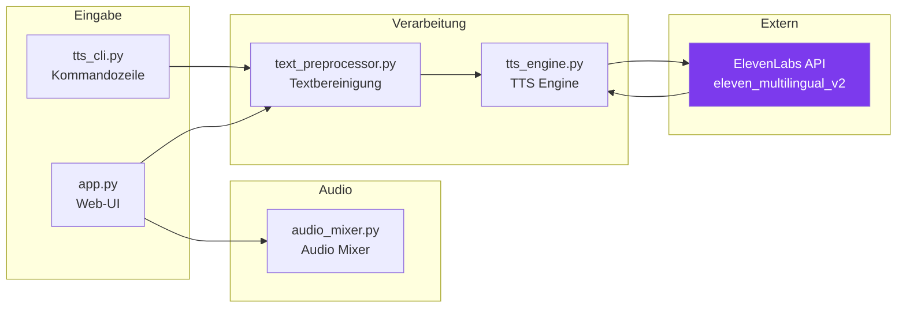
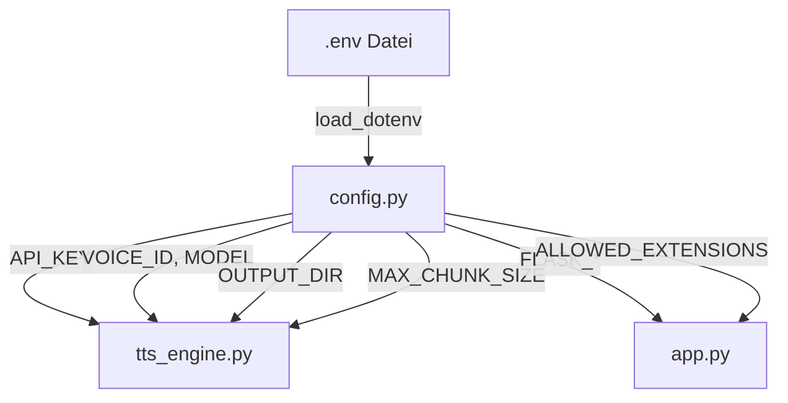
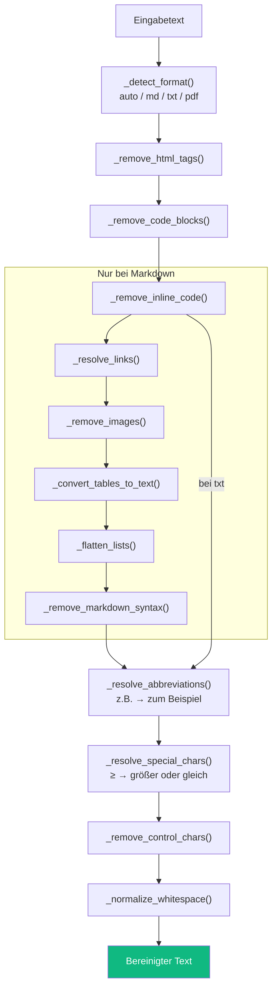
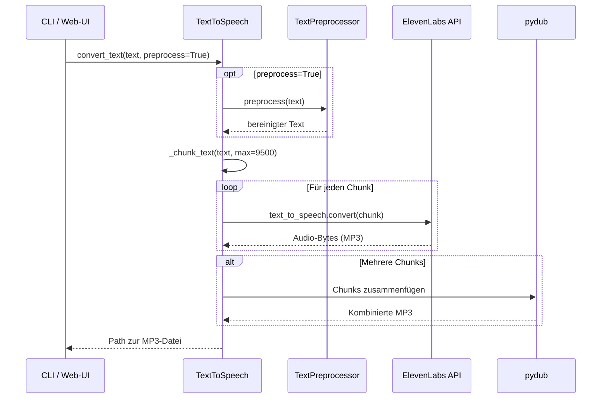
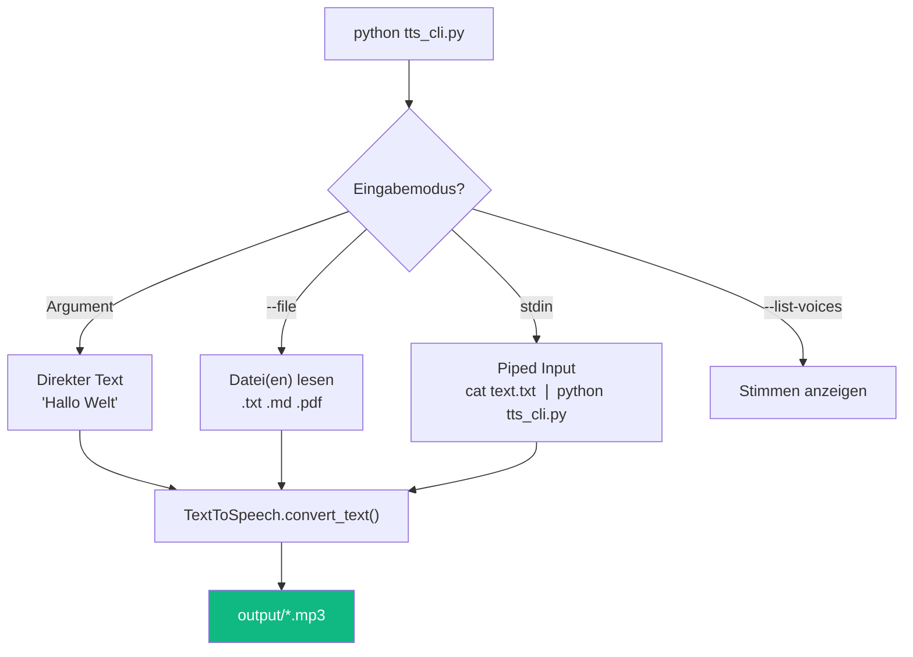
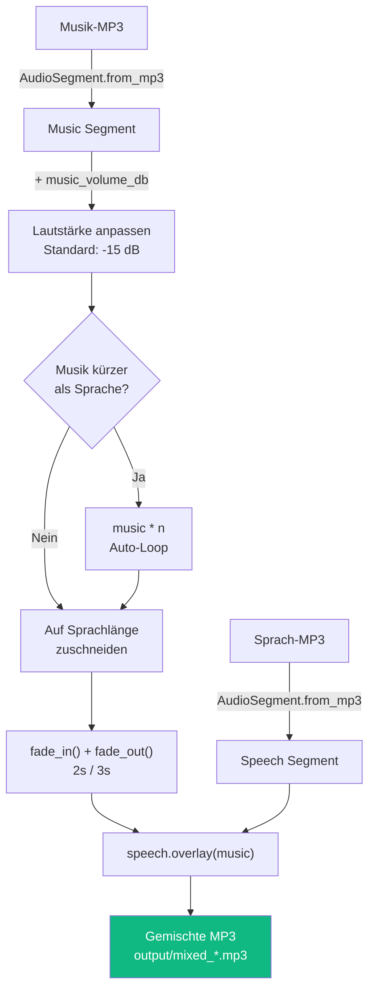
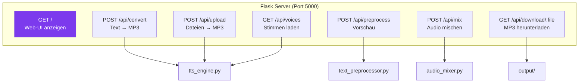
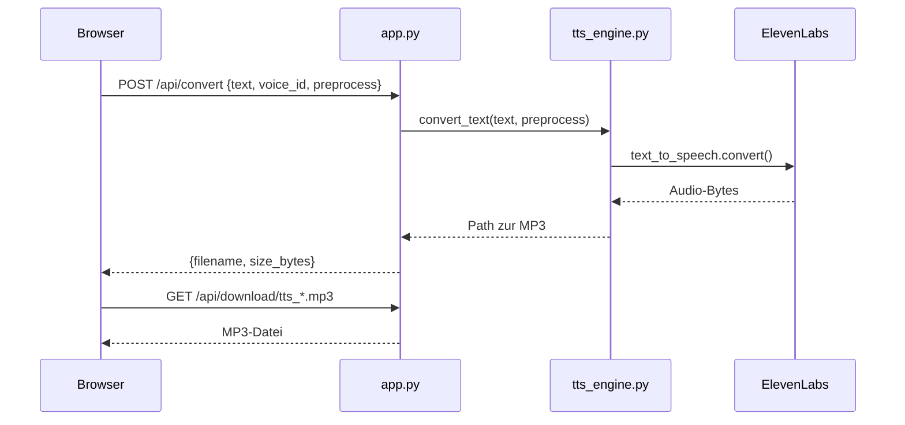
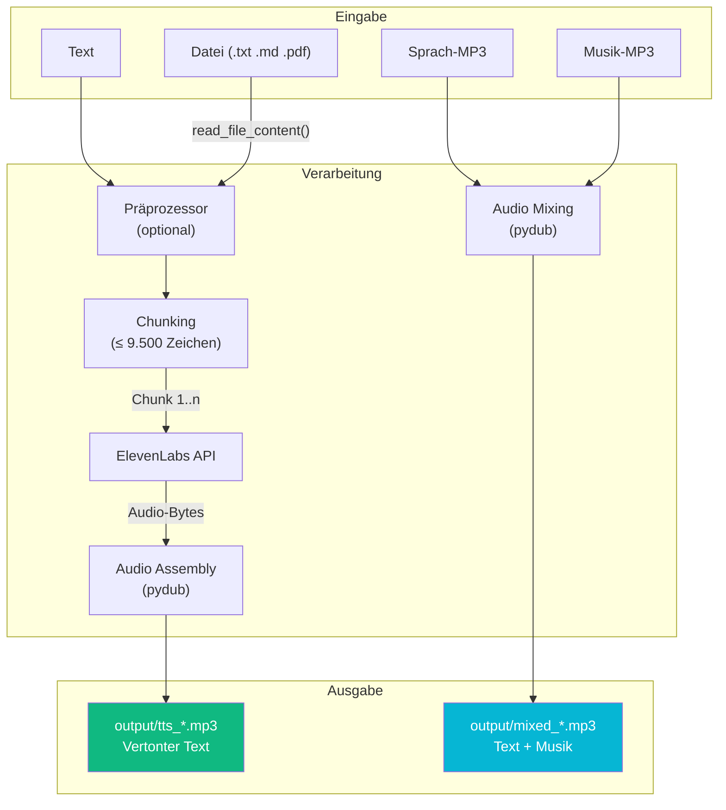
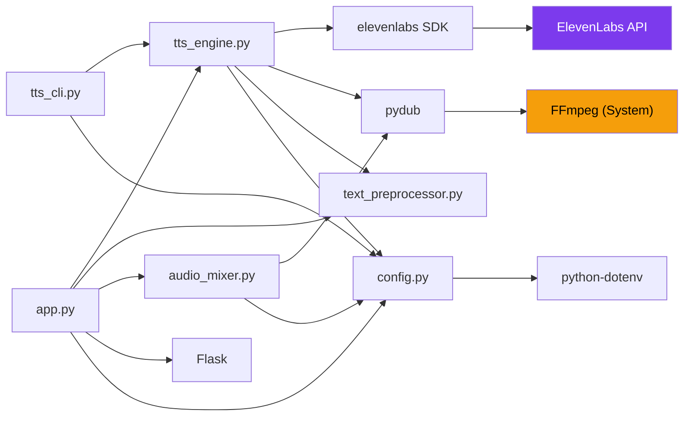

# Architektur – Text-to-Speech Toolkit

## Überblick

Das TTS-Toolkit wandelt Text in natürlich klingende MP3-Dateien um. Es besteht aus fünf Modulen, die unabhängig voneinander nutzbar sind, aber aufeinander aufbauen.



## Modulübersicht

### 1. config.py – Konfiguration

Zentrale Stelle für alle Einstellungen. Lädt Werte aus `.env` und stellt Defaults bereit.



| Variable | Default | Beschreibung |
|----------|---------|-------------|
| `ELEVENLABS_API_KEY` | *(aus .env)* | API-Schlüssel |
| `DEFAULT_VOICE_ID` | `NBqeXKdZHweef6y0B67V` | Stimme „Christian" |
| `DEFAULT_MODEL` | `eleven_multilingual_v2` | TTS-Modell |
| `OUTPUT_FORMAT` | `mp3_44100_128` | Audio-Qualität |
| `MAX_CHUNK_SIZE` | `9500` | Zeichen pro API-Aufruf |
| `OUTPUT_DIR` | `output/` | Ausgabeverzeichnis |
| `PREPROCESS_DEFAULT` | `False` | Präprozessor standardmäßig aus |

---

### 2. text_preprocessor.py – Textbereinigung

Optionales Modul, das Text vor der Vertonung für natürliches Vorlesen aufbereitet. Jeder Schritt ist eine eigene Methode der Klasse `TextPreprocessor`.



**Design-Prinzip**: Einzelne Schritte können übersprungen werden, indem der `source_format`-Parameter gesetzt wird. Bei `"txt"` werden Markdown-spezifische Schritte nicht ausgeführt.

---

### 3. tts_engine.py – TTS Engine

Das Herzstück: Nimmt Text entgegen und liefert eine MP3-Datei.



**Chunking-Algorithmus** – Priorität der Trennstellen:

1. Absatzende (`\n\n`) – bevorzugt ab 50% der Chunk-Größe
2. Satzende (`. `, `! `, `? `) – ab 30%
3. Zeilenende (`\n`) – ab 30%
4. Komma/Semikolon – ab 30%
5. Wortgrenze (Leerzeichen) – Fallback
6. Harte Grenze bei `MAX_CHUNK_SIZE` – letzter Fallback

---

### 4. tts_cli.py – Kommandozeilen-Tool

Wrapper um `tts_engine.py` mit `argparse`. Unterstützt drei Eingabemodi:



---

### 5. audio_mixer.py – Audio Mixer

Überlagert eine Sprach-MP3 mit einer Musik-MP3 mittels `pydub`.



---

### 6. app.py – Flask Web-Server

REST-API mit 6 Endpoints, die alle Module orchestriert:



**Request-Flow für Text-Konvertierung:**



---

## Datenfluss



---

## Verzeichnisstruktur

```
text-to-speech/
├── config.py               ← Konfiguration (lädt .env)
├── text_preprocessor.py    ← Textbereinigung (10 Schritte)
├── tts_engine.py           ← Kern: Chunking + ElevenLabs API
├── tts_cli.py              ← CLI-Wrapper
├── audio_mixer.py          ← Sprache + Musik mischen
├── app.py                  ← Flask Web-Server
│
├── templates/
│   └── index.html          ← Single-Page Web-UI
├── static/
│   ├── css/style.css       ← Dark-Mode Design
│   └── js/app.js           ← Frontend-Logik
│
├── output/                 ← Generierte MP3s (gitignored)
├── uploads/                ← Temporäre Uploads (gitignored)
│
├── .env                    ← API-Key (gitignored)
├── .env.example            ← Vorlage
├── requirements.txt        ← Dependencies
├── .gitignore
└── README.md
```

## Abhängigkeiten


